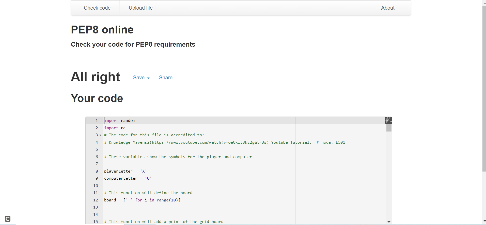
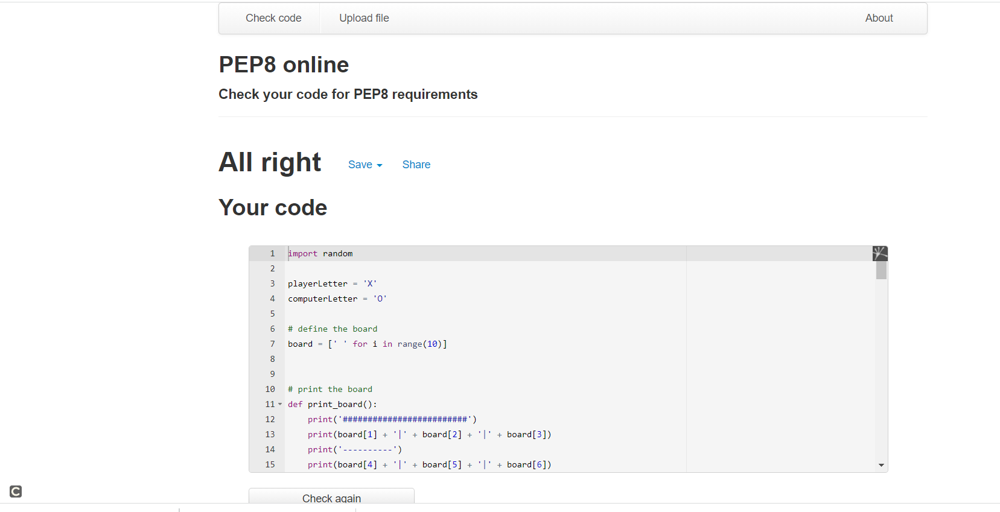

# Fun-Ships

- Fun-Ships is a noughts and crosses game (tik tak toe in American) designed on the original paper played game.

- For more information about noughts and crosses check out [Wikipedia](https://en.wikipedia.org/wiki/Tic-tac-toe)

- Funships is coded in python and the code is outputted in the terminal the game is also deployed to Heroku.

- The game is designed to be played by a single person against the computer.

- The objective of the game is for the player to place  3 X's on the grid board in a line to win.

## How To Play

- The player has to input a number from 1 to 9.

- Then the player is prompted to enter another number.

- X represents the players symbol on the grid.

- O represents the computer symbol on the grid.

- The player must try to get three x's in a line.

- The Computer will try to block the player.

- The player and the computer can start the game.

## Features

### Existing Features

- The screenshot below is the game displayed on various screens.

- [Game On Various Screens](assets/screenshots/multiscreen.png)

- There ia a grid board for the player to play the game.

- The player is greeted with a welcome.

- The player is given an option to input a number value for the grid board from 1 - 9.

- The screenshot below shows the start of the game.

- [Start The Game](assets/screenshots/startgames.png)

- The player is prompted again to input a numnber and this will continue until either the player or computer wins, 
  loses or there is a draw.

- If both sides score a draw the player will be notified as shown in the draw screenshot below.

- [There is a draw](assets/screenshots/draw.png)

- If the player loses the game this will be displayed in the terminal as seen in the screenshot below.

- [Player has lost the game](assets/screenshots/lost.png)

- If the player inputs letters, symbols or an empty return the following message will be displayed by the computer.

- [Message For Incorrect Inputs](assets/screenshots/inputreq.png)

- The screenshot below displays the response when the player inputs the wrong number

- [Wrong Number](assets/screenshots/wrongnum.png)

### Future Features

- Allow player to have the opportunity to play against someone else.

###  Data Model
 
The model that I am using for this project is based on a grid board function.

The grid board function contains both the players turn and the computers turn.

The grid board functions are, define the board, who goes first, print the board, is the board full, check if there is a winner,
is a space free, place a marker on the board, who goes first, player turn, create a copy of the board, computer turn, check if player can win, if computer plays first, and run the game.

There is a choice to put in a number between 1 to 9.

###  Testing

- I did manual testing on the project by:

- Putting the code into the Pep8 linter validator testing check.  The code was passed without any problems and errors.

- I also did tests on the inputs to see what would happen if I inputted a number above 9. The function works because 
  the player is prompted to input a number between 1 and 9.

  I did a test with my mentor to see what would happen if I inputted a letter, a symbol and an empty space.  A bug was removed. The output for this test was working and informed the player to select the correct input required to play the game (numbers between 1-9)

- The code was also tested on the local terminal and in Heroku. 

###  Bugs

- There were bugs in the code that inhibited it from running properly.  I had to contact tutor support and reach out to the slack community for support. The bugs were related to the nesting of the code in the loops.

The bugs were removed and it was the tutorial from Knowledge Mavens that helped to do checks.

- [Knowledge Mavens](https://www.youtube.com/watch?v=oe0kIt3kE2g&t=3s) Youtube Tutorial.

### Bugs and Invalid Data Rectified From Submission of First Project
- Through the assessors kind feedback of the project it was noted in the assessment that in criteria 2.1 had failed as the allowance of invalid data entry causes the function to go wrong.  Through the support of my mentor and the tutor support we managed to locate the specific issue of why the game was allowing 0 to be accepted as an input.  This was rectified with the code being made more specific to what input was allowed to be run. 

- The assessor also kindly noted in the feedback that " The input range of the game is 1-9, however, the program takes 0 as input and proceeds. Moreover, when the user gives input of -1 the program does not raise error, accepts the user input." 

- Through the kind support of the tutors I was able to rectify the above issue by adding the code below to ensure that only the specified integers could be accepted from 1-9.  The game will not accept 0 as an input now. The -1 problem was resolved I also checked with +1 and this was not accepted.  

- The code that I used to rectify this is re.match(r'^\d+$', str(position)):
I also had to put import re at the top.  The tutors at the Code Institute helped me with this.

- The code that was inputting the incorrect data entry value was located in player turn.  
The code was rectified and the code now works and invalid data entry is not permitted. My mentor Miguel Martinez and the tutors at code institute helped me with this.  I am very grateful to them for their kind support.

### player turn
def player_turn():
    """ player turn docstring """
    while True:
        try:
            position = input('Choose a number between 1 & 9: ')
            if re.match(r'^\d+$', str(position)):
                position = int(position)
            else:
                print('Please choose a number between 1 and 9, have another go')  # noqa: E501
                continue
            if position < 1 or position > 9:
                print('Please choose a number between 1 and 9, have another go')  # noqa: E501
            else:
                if is_free(board, position):
                    place_marker(board, playerLetter, position)
                    break
                else:
                    print('This position is not free, please try again')
        except ValueError:
            print("not a valid input")

###  Remaining Bugs

No remaining bugs

###  Validator Testing

- Removed errors from code after checking in pep8 mainly indentation errors were removed. 24/10/21.

- pep8
       - No errors were returned from pep8online.com.

 - The screenshot below is the most updated Pep 8 online check done taken on the 12 of February 2022 for 
 - the resubmission of this project.
 
 

 

###  Deployment
- The project was deployed using the code Instiutes mock terminal for Heroku.

  - Steps for deployment:
      - Fork or clone this repository
      - Creat a new Heroku app
      - Set the build blocks to Python and Nodejs in that order 
      - Link the Heroku app to the repository
      - Click on **Deploy**
      
      - https://fun-ships.herokuapp.com/

###  Credits

- Data modelling information from Database Design 2nd Edition

- [Database Design](https://opentextbc.ca/dbdesign01/chapter/chapter-4-types-of-database-models/)

- [Database Design](https://opentextbc.ca/dbdesign01/chapter/chapter-5-data-modelling/)

- The code for adding the import random is accredited to:

- [Knowledge Mavens](https://www.youtube.com/watch?v=oe0kIt3kE2g&t=3s) Youtube Tutorial.

- The code for adding playerLetter and the computerLetter with values is accredited to:

- [Knowledge Mavens](https://www.youtube.com/watch?v=oe0kIt3kE2g&t=3s) Youtube Tutorial.

- The code for define the board is accredited to:

- [Knowledge Mavens](https://www.youtube.com/watch?v=oe0kIt3kE2g&t=3s) Youtube Tutorial.

- The code for the print_board function is accredited to:

- [Knowledge Mavens](https://www.youtube.com/watch?v=oe0kIt3kE2g&t=3s) Youtube Tutorial.

- The code for the is_full function is accredited to:

- [Knowledge Mavens](https://www.youtube.com/watch?v=oe0kIt3kE2g&t=3s) Youtube Tutorial.

- The code for the check_win function is accredited to:

- [Knowledge Mavens](https://www.youtube.com/watch?v=oe0kIt3kE2g&t=3s) Youtube Tutorial.

- The code for the is_free function is accredited to:

- [Knowledge Mavens](https://www.youtube.com/watch?v=oe0kIt3kE2g&t=3s) Youtube Tutorial.

- The code for the place_marker function is accredited to:

- [Knowledge Mavens](https://www.youtube.com/watch?v=oe0kIt3kE2g&t=3s) Youtube Tutorial.

- The code for the who_goes_first function is accredited to:

- [Knowledge Mavens](https://www.youtube.com/watch?v=oe0kIt3kE2g&t=3s) Youtube Tutorial.

- Credits to the tutor support and slack community for supporting me with bug fixes and 
  resolving errors in the code.

- The bug and errors in the code were resolved by checking with the Youtube tutorial from:

- [Knowledge Mavens](https://www.youtube.com/watch?v=oe0kIt3kE2g&t=3s) Youtube Tutorial.

- The other resources to sort the bugs were:

- [Stack overflow](https://stackoverflow.com/questions/52809455/nested-loops-in-python)

- [Geeks for Geeks](https://www.geeksforgeeks.org/loops-in-python/)

- The code for the player_turn function is accredited to:

- [Knowledge Mavens](https://www.youtube.com/watch?v=oe0kIt3kE2g&t=3s) Youtube Tutorial.

- The code for the duplicate _board function is accredited to:

- [Knowledge Mavens](https://www.youtube.com/watch?v=oe0kIt3kE2g&t=3s) Youtube Tutorial.

- The code for the computer_turn function is accredited to:

- [Knowledge Mavens](https://www.youtube.com/watch?v=oe0kIt3kE2g&t=3s) Youtube Tutorial.

- The code for the check if the player can win function is accredited to:

- [Knowledge Mavens](https://www.youtube.com/watch?v=oe0kIt3kE2g&t=3s) Youtube Tutorial.

- The code for the if computer plays first function is accredited to:

- [Knowledge Mavens](https://www.youtube.com/watch?v=oe0kIt3kE2g&t=3s) Youtube Tutorial.

- The code for the run the game function is accredited to:

- [Knowledge Mavens](https://www.youtube.com/watch?v=oe0kIt3kE2g&t=3s) Youtube Tutorial.

- The code for the start the game function is accredited to:

- [Knowledge Mavens](https://www.youtube.com/watch?v=oe0kIt3kE2g&t=3s) Youtube Tutorial.

- To add the # noqa: E501 at the end of line 112 is accredited to the tutors at the Code Institute 
  for helping me to rectify this warning in pep 8 online validation checker.

- To remove the white trailing spaces from the code is accredited to fellow students on Slack and 
  the tutor support team.

- In my mentoring session my mentor highlighted the need to check my code thoroughly for bugs and errors.  My mentor has really
  empowered me to find solutions with debugging the code, thinking about what the code is doing and keeping focused with the 
  project. My mentor is an excellent support for me in helping me to code better.

- My mentor also identified a bug on line 62 onwards and he empowered me to try and find a solution into how this could rectified.
  we had to look at using the Whilst true, Try, Break and Except code to get the bug and error removed.

- I was informed by tutor support to use print() under lines of code to try to identify errors and bugs in why the code
  is not working.

- Tutor support also advised me to use the collapable arrows on the side of the code line so as to check if specific sections of 
  a loop are aligned correctly.

- Fellow students on slack showed me how to use the debugger in the python file and how to try to find bugs in the code.

- One thing that I really learnt with python is the importance of indentation in the code and how incorrect indentation can make 
  the code inoperative.

- A very good resource for helping with code structurtes with python.
  [tutorialspoint](https://www.tutorialspoint.com/python/python_continue_statement.htm)

The credits below were used for the design of previous projects,  I decided to keep them in the credits for both reference and research purposes.

- HIDDEN_BOARD and GUESS_BOARD is accredited to:

- [Knowledge Mavens](https://www.youtube.com/watch?v=tF1WRCrd_HQ&t=66s) Youtube Tutorial.

- These functions code used in the project, def board():, def make_ships():, def bring_ship_place():, def count_attacked_ships():,
are all accredited to:

- [Knowledge Mavens](https://www.youtube.com/watch?v=tF1WRCrd_HQ&t=66s) Youtube Tutorial.

- The code added to the print_board function is accredited to:

- [Knowledge Mavens](https://www.youtube.com/watch?v=tF1WRCrd_HQ&t=66s) Youtube Tutorial.

- The random function import is accredited to both:

- [Knowledge Mavens](https://www.youtube.com/watch?v=tF1WRCrd_HQ&t=66s) Youtube Tutorial.

- The code institute python essentials information.

- The code added to the make_ships function is accredited to:

- [Knowledge Mavens](https://www.youtube.com/watch?v=tF1WRCrd_HQ&t=66s) Youtube Tutorial.

- The comment added at the top of the code file for the legend is accredited to:

- [Knowledge Mavens](https://www.youtube.com/watch?v=tF1WRCrd_HQ&t=66s) Youtube Tutorial.

- The code added to the bring_ships_place function is accredited to:

- [Knowledge Mavens](https://www.youtube.com/watch?v=tF1WRCrd_HQ&t=66s) Youtube Tutorial.

- The code added to the count_attacked_ships function  is accredited to:

- [Knowledge Mavens](https://www.youtube.com/watch?v=tF1WRCrd_HQ&t=66s) Youtube Tutorial.

- The code added to the make_ships function  is accredited to:

- [Knowledge Mavens](https://www.youtube.com/watch?v=tF1WRCrd_HQ&t=66s) Youtube Tutorial.

- The information on constructing and checking the readme for the battleships game is accredited to the Code Institute
Battleships game readme.

- My Mentor Miguel Martinez helped me to align the grid with spaces, and the lines.  Better visibility for the player.

- Martin also helped me to insert line breaks for the input sections for the numbers and the letters.

- The code below is accredited to:

- [Knowledge Mavens](https://www.youtube.com/watch?v=tF1WRCrd_HQ&t=66s) Youtube Tutorial.

- LENGTH_OF_SHIPS = [2, 3, 3, 4, 5]
- PLAYER_BOARD = [[" "] * 8 for i in range(8)]
- COMPUTER_BOARD = [[" "] * 8 for i in range(8)]
- PLAYER_GUESS_BOARD = [[" "] * 8 for i in range(8)]
- COMPUTER_GUESS_BOARD = [[" "] * 8 for i in range(8)]
- LET_TO_NUM = {'A': 0, 'B': 1, 'C': 2, 'D': 3, 'E': 4, 'F': 5, 'G': 6, 'H': 7}

- The code added to the print_board function  is accredited to:

- [Knowledge Mavens](https://www.youtube.com/watch?v=tF1WRCrd_HQ&t=66s) Youtube Tutorial.

- The import random is accredited to:

- [Knowledge Mavens](https://www.youtube.com/watch?v=tF1WRCrd_HQ&t=66s) Youtube Tutorial.

- The code added to the place_ships function  is accredited to:

- [Knowledge Mavens](https://www.youtube.com/watch?v=tF1WRCrd_HQ&t=66s) Youtube Tutorial.

- The code added to the check_ship_fit  function  is accredited to:

- [Knowledge Mavens](https://www.youtube.com/watch?v=tF1WRCrd_HQ&t=66s) Youtube Tutorial.

### Disclaimer

- The contents of this project are solely for the purposes of education and research.  
- All of  the information and code that has been used from outside resources has be accredited to that person or organisation.

### Acknowledgements

I would like to thank my mentor Miguel Martinez for being an excellent mentor anf guiding me with the project.  Miguel's insights, experince and knowledge have empowered me to try to do my best and not to give up.

I would like to thank fellow students from slack and Matt Bodden the 5p lead in encouraging me to do my best.

I would like to thank Scott and Ed from the tutor support team to find good solutions whislt working with my code.

I would like to thank the whole of the tutor support for helping me with coding issues.

I would like to thank the student care team, Alex, Kieron and Aoife for listening to me and pointing me in the right direction.

I would like to thank my friends Claire and Holly for believing in me and checking on me when I was stressed with the course work and the project.

I would like thank Claire's pets, Bodhi (dog), Lass (dog), Mitzy (dog), Kiddy (cat) and Rabsie (rabbit), for sitting with me whilst I was doing my work and the endless support they gave me.  The dog walks helped me to get fresh air into my brain cells.

    

